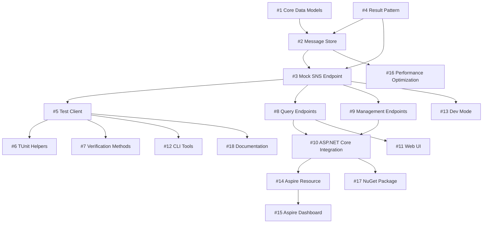

# TopicTracker Development Order Guide

This document provides explicit guidance on the order in which issues should be addressed, including dependencies and parallel work opportunities.

## 🎯 Development Principles

1. **Foundation First**: Core components must be built before dependent features
2. **Test Infrastructure Early**: Testing tools enable TDD for subsequent features
3. **Parallel When Possible**: Independent features can be developed simultaneously
4. **Integration Last**: Platform integrations come after core functionality is stable

## 📋 Critical Path (Must be done in order)

### Step 1: Core Data Models (#1)
**Why First**: Everything depends on the data structures
- Define `CapturedSnsMessage`, `SnsPublishRequest`, `MessageAttribute`
- Implement source-generated JSON serialization
- No dependencies, can start immediately

### Step 2: Result Pattern Integration (#4)
**Why Second**: Error handling pattern used throughout the codebase
- Define common error types
- Create Result<T> extension methods
- Required by: Message Store (#2), Mock SNS Endpoint (#3)

### Step 3: Thread-Safe Message Store (#2)
**Why Third**: Core storage mechanism for all features
- Depends on: Core Data Models (#1), Result Pattern (#4)
- Required by: Mock SNS Endpoint (#3), Test Client (#5)

### Step 4: Mock SNS Endpoint (#3)
**Why Fourth**: Primary API that captures messages
- Depends on: Message Store (#2), Result Pattern (#4)
- Required by: Test Client (#5), all integration tests

## 🚀 Parallel Development Opportunities

Once the critical path (Steps 1-4) is complete, multiple tracks can proceed in parallel:

### Track A: Testing Infrastructure
Can be developed after Mock SNS Endpoint (#3):
- **TopicTracker Test Client (#5)** - Primary testing tool
- **TUnit Test Helpers (#6)** - Can start after Test Client
- **Verification Methods (#7)** - Extends Test Client capabilities

### Track B: API Development
Can be developed after Mock SNS Endpoint (#3):
- **Query Endpoints (#8)** - RESTful message retrieval
- **Management Endpoints (#9)** - Admin functionality
- Both can be developed simultaneously

### Track C: Integration Packages
Can start after Query Endpoints (#8):
- **ASP.NET Core Integration (#10)** - DI and configuration helpers

## 📊 Recommended Sprint Organization

### Sprint 1 (Week 1)
**Goal**: Complete critical foundation
- [ ] #1 Core Data Models
- [ ] #4 Result Pattern Integration
- [ ] #2 Thread-Safe Message Store (start)

### Sprint 2 (Week 2)
**Goal**: Complete core functionality
- [ ] #2 Thread-Safe Message Store (complete)
- [ ] #3 Mock SNS Endpoint
- [ ] #5 TopicTracker Test Client (start)

### Sprint 3 (Week 3)
**Goal**: Testing infrastructure & APIs
- [ ] #5 TopicTracker Test Client (complete)
- [ ] #6 TUnit Test Helpers
- [ ] #7 Verification Methods
- [ ] #8 Query Endpoints (start)
- [ ] #9 Management Endpoints (start)

### Sprint 4 (Week 4)
**Goal**: Complete APIs & integration
- [ ] #8 Query Endpoints (complete)
- [ ] #9 Management Endpoints (complete)
- [ ] #10 ASP.NET Core Integration
- [ ] #11 Web UI Dashboard (start)

### Sprint 5 (Week 5)
**Goal**: Developer experience & platform
- [ ] #11 Web UI Dashboard (complete)
- [ ] #12 CLI Tools
- [ ] #13 Development Mode Features
- [ ] #14 .NET Aspire Resource (start)

### Sprint 6 (Week 6)
**Goal**: Platform integration & optimization
- [ ] #14 .NET Aspire Resource (complete)
- [ ] #15 Aspire Dashboard Integration
- [ ] #16 Performance Optimization (start)

### Sprint 7 (Week 7)
**Goal**: Production readiness
- [ ] #16 Performance Optimization (complete)
- [ ] #17 NuGet Package & Distribution
- [ ] #18 Comprehensive Documentation

## 🔗 Dependency Graph

## 💡 Development Tips

### Starting a New Issue
1. Check all dependencies are complete
2. Read the issue's "Development Guidelines" section
3. Start with the TDD Red Phase - write failing tests first
4. Reference CLAUDE.md and AGENT-GUIDELINES.md

### Handling Blocked Work
If blocked by dependencies:
1. Check if any parallel track work is available
2. Help review/test completed dependencies
3. Start planning/designing your feature
4. Write interface definitions that dependencies will implement

### Quality Gates
Before marking any issue complete:
- [ ] All tests written first (TDD)
- [ ] >90% code coverage
- [ ] Performance benchmarks pass (where applicable)
- [ ] XML documentation complete
- [ ] Integration tests pass
- [ ] PR approved by maintainer

## 🏁 Definition of Done

An issue is considered complete when:
1. All acceptance criteria are met
2. Code coverage exceeds 90%
3. All tests pass (including integration tests)
4. Documentation is complete
5. Performance targets are met (where applicable)
6. Code follows patterns in CLAUDE.md and AGENT-GUIDELINES.md
7. PR is merged to main branch

## 📈 Progress Tracking

Progress can be monitored at:
- [GitHub Project Board](https://github.com/dwalleck/TopicTracker/projects)
- [Progress Dashboard](./PROGRESS.md)
- [Meta Issue #19](https://github.com/dwalleck/TopicTracker/issues/19)